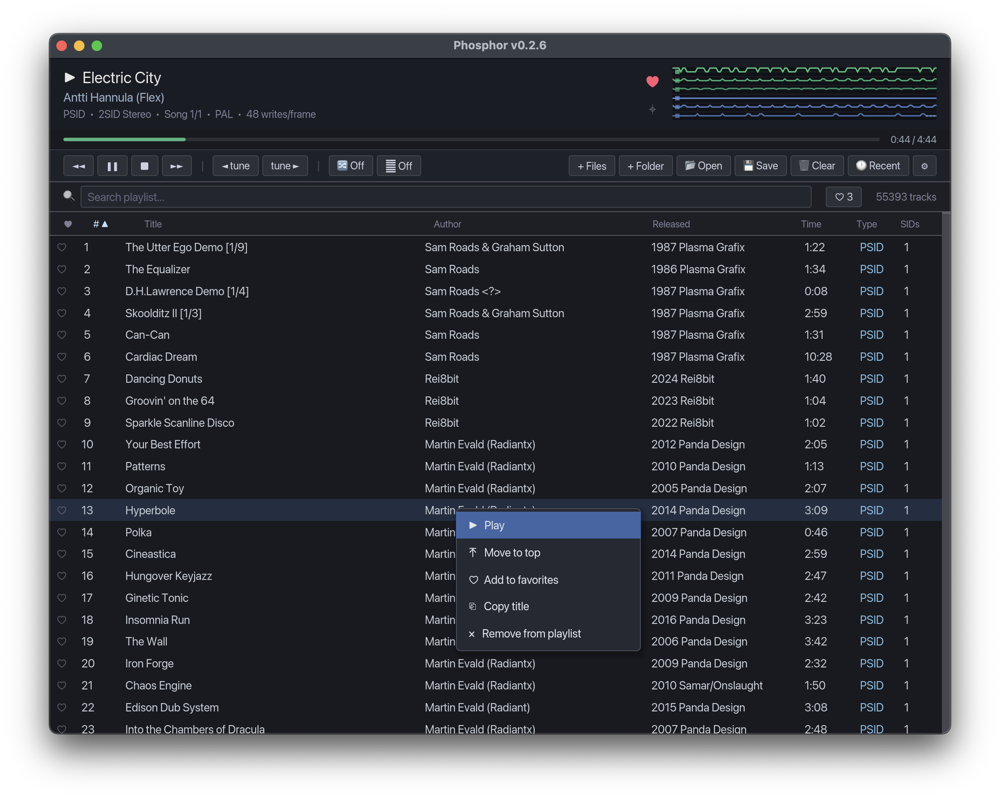

# Phosphor
A SID music player for [USBSID-Pico](https://github.com/LouDnl/USBSID-Pico) hardware, software emulation, and Commodore [Ultimate 64](https://ultimate64.com/) network playback. Built with Rust and Iced.




## Downloads

Prebuilt binaries for macOS, Windows are available on the GitHub **Releases** page:
https://github.com/sandlbn/Phosphor/releases

> **⚠️ Work in progress.** PSID playback works well. RSID support is experimental and many tunes won't play correctly yet.

## Playback Engines

Phosphor supports three SID output engines, selectable in Settings:

- **USB** — USBSID-Pico hardware (register-level writes)
- **Emulated** — Software SID via resid-rs + cpal audio
- **Commodore Ultimate 64 / Elite** — Native playback on real C64 hardware via REST API

## Requirements

- Rust toolchain (`cargo`)
- SID files (e.g. from [HVSC](https://www.hvsc.c64.org/))
- One or more of: USBSID-Pico device, audio output (for emulation), or Commodore Ultimate 64 / Elite / Ultimate-II+ on the network

## Install

### macOS

The bridge daemon runs as root via launchd to handle USB access:

```bash
chmod +x install.sh
./install.sh
```

This builds Phosphor and the bridge daemon, installs the LaunchDaemon, and starts it. Run with:

```bash
./target/release/phosphor
```

To uninstall the daemon:

```bash
sudo launchctl unload /Library/LaunchDaemons/com.phosphor.usbsid-bridge.plist
sudo rm /usr/local/bin/usbsid-bridge
sudo rm /Library/LaunchDaemons/com.phosphor.usbsid-bridge.plist
```

### Windows

1. Install the WinUSB driver for your USBSID-Pico using [Zadig](https://zadig.akeo.ie/)
2. Build and run:

```bash
cargo build --release
./target/release/phosphor.exe
```

### Linux

1. Add a udev rule for the USBSID-Pico (VID `cafe`):

```bash
echo 'SUBSYSTEM=="usb", ATTR{idVendor}=="cafe", MODE="0666"' | sudo tee /etc/udev/rules.d/99-usbsid.rules
sudo udevadm control --reload-rules
```

2. Build and run:

```bash
cargo build --release
./target/release/phosphor
```