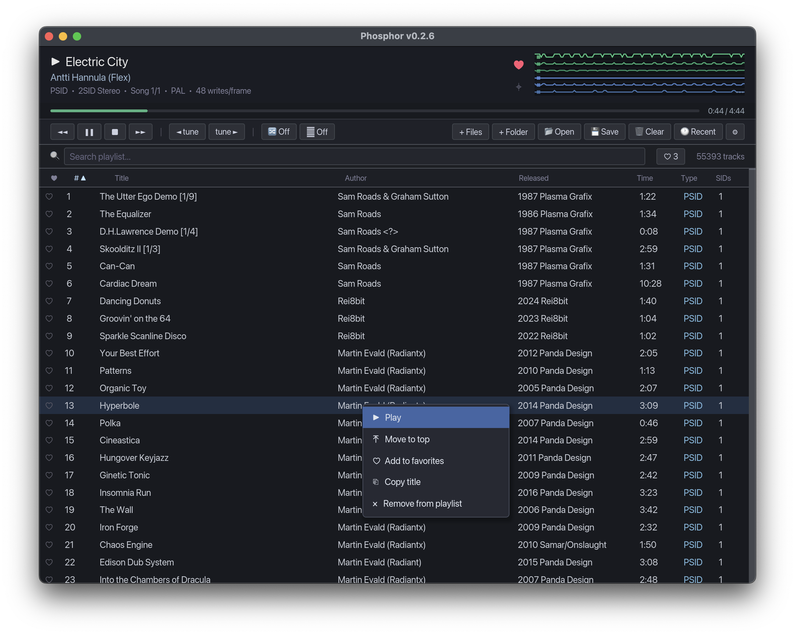

# Phosphor

A SID music player for [USBSID-Pico](https://github.com/LouDnl/USBSID-Pico) hardware, software emulation, and Commodore [Ultimate 64](https://ultimate64.com/) network playback. Built with Rust and Iced.




## Downloads

Prebuilt binaries for macOS, Linux and Windows are available on the GitHub **Releases** page:
https://github.com/sandlbn/Phosphor/releases

> **⚠️ Work in progress.** PSID playback works well. RSID support is experimental and many tunes won't play correctly yet.

## Features

- **Three playback engines** — USB hardware, software emulation, or Commodore Ultimate 64 over the network
- **Playlist management** — add files and folders, drag & drop, save/load M3U playlists
- **Sortable columns** — click any column header to sort by title, author, released, duration, type, or SID count
- **Search & filter** — real-time search across title, author, released year, and file path
- **Favorites** — heart any tune; filter playlist to favorites only
- **Recently played** — persistent history of the last 100 unique tracks with human-readable timestamps
- **HVSC Songlength DB** — automatic song-length lookup with configurable fallback duration
- **Multi-SID support** — PSID/RSID, 1SID/2SID/3SID tunes, PAL/NTSC
- **Sub-tune navigation** — step through all sub-tunes within a SID file
- **Keyboard shortcuts** — full keyboard control (see below)
- **Window geometry** — size and position are remembered between sessions

## Keyboard Shortcuts

| Key | Action |
|-----|--------|
| `Space` | Play / Pause |
| `←` | Previous track |
| `→` | Next track |
| `↑` | Select previous track in playlist |
| `↓` | Select next track in playlist |
| `Delete` | Remove selected track |
| `Ctrl+F` | Focus search |

## Playback Engines

Selectable in Settings (⚙):

- **Auto** — tries USB first, falls back to software emulation
- **USB** — USBSID-Pico hardware via register-level writes
- **Emulated** — software SID via resid-rs + cpal audio output
- **Ultimate 64** — native playback on Ultimate 64 Carts / Commodore 64 Ultimate or Elite II via REST API

## Requirements

- Rust toolchain (`cargo`)
- SID files (e.g. from [HVSC](https://www.hvsc.c64.org/))
- One or more of: USBSID-Pico device, audio output (for emulation), or Commodore Ultimate 64 / Elite / Ultimate-II+ on the network

## Install

### macOS

The bridge daemon runs as root via launchd to handle USB access:

```bash
chmod +x install.sh
./install.sh
```

This builds Phosphor and the bridge daemon, installs the LaunchDaemon, and starts it. Run with:

```bash
./target/release/phosphor
```

To uninstall the daemon:

```bash
sudo launchctl unload /Library/LaunchDaemons/com.phosphor.usbsid-bridge.plist
sudo rm /usr/local/bin/usbsid-bridge
sudo rm /Library/LaunchDaemons/com.phosphor.usbsid-bridge.plist
```

### Windows

1. Install the WinUSB driver for your USBSID-Pico using [Zadig](https://zadig.akeo.ie/)
2. Build and run:

```bash
cargo build --release
./target/release/phosphor.exe
```

### Linux

1. Add a udev rule for the USBSID-Pico (VID `cafe`):

```bash
echo 'SUBSYSTEM=="usb", ATTR{idVendor}=="cafe", MODE="0666"' | sudo tee /etc/udev/rules.d/99-usbsid.rules
sudo udevadm control --reload-rules
```

2. Build and run:

```bash
cargo build --release
./target/release/phosphor
```

## Configuration

Phosphor stores its configuration in:

| Platform | Path |
|----------|------|
| macOS | `~/Library/Application Support/phosphor/` |
| Linux | `~/.config/phosphor/` |
| Windows | `%APPDATA%\phosphor\` |

Files stored there:

| File | Contents |
|------|----------|
| `config.json` | Settings, window geometry, last-used directories |
| `favorites.txt` | Favorited tune MD5 hashes (one per line) |
| `recently_played.json` | Last 100 played tracks with timestamps |
| `Songlengths.md5` | Cached HVSC Songlength database |
