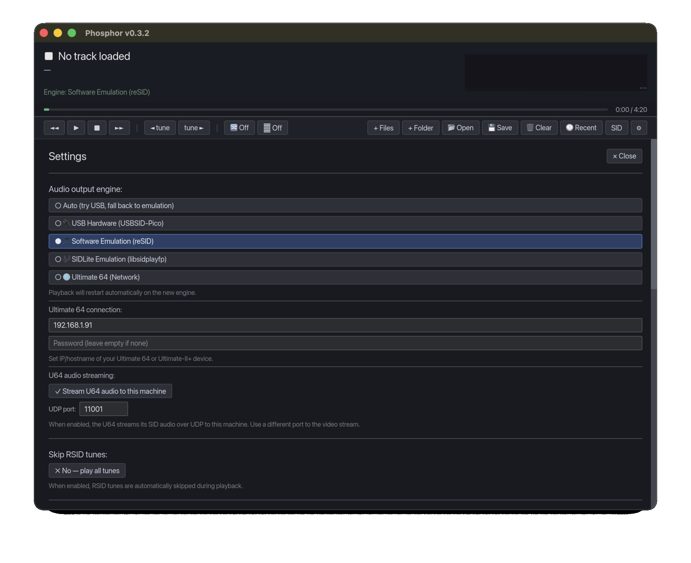

# Phosphor

A SID music player for [USBSID-Pico](https://github.com/LouDnl/USBSID-Pico) hardware, software emulation, and Commodore [Ultimate 64](https://ultimate64.com/) network playback. Built with Rust and Iced.




## Downloads

Prebuilt binaries for macOS, Linux and Windows are available on the GitHub **Releases** page:

https://github.com/sandlbn/Phosphor/releases

## Features

- **Four playback engines** — USB hardware, software emulation (reSID or SIDLite), or Commodore Ultimate 64 over the network
- **HTTP remote control** — built-in web server for controlling playback from any browser on the network (phone, tablet, another PC)
- **Playlist management** — add files and folders, drag & drop, save/load M3U playlists; duplicate detection on import
- **Session restore** — playlist automatically saved on exit and restored on next launch
- **Sortable columns** — click any column header to sort by title, author, released, duration, type, or SID count
- **Search & filter** — real-time search across title, author, released year, and file path
- **Favorites** — heart any tune; filter playlist to favorites only
- **Recently played** — persistent history of the last 100 unique tracks with human-readable timestamps
- **HVSC Songlength DB** — automatic song-length lookup with configurable fallback duration
- **HVSC STIL** — song info overlay (cover titles, original artists, composer comments) via the ⓘ button; downloaded or loaded from a local STIL.txt
- **MUS file support** — Compute's Gazette SIDplayer format with stereo (MUS+STR), PETSCII lyrics display (WDS), and real-time karaoke mode synchronized via FLAG commands
- **Multi-SID support** — PSID/RSID, 1SID/2SID/3SID tunes, PAL/NTSC
- **Sub-tune navigation** — step through all sub-tunes within a SID file
- **SID register panel** — real-time scrolling tracker view (note, waveform, ADSR per voice) plus live register readout for all active SID chips
- **U64 audio streaming** — stream SID audio from the Ultimate 64 back to the host machine over UDP
- **Keyboard shortcuts** — full keyboard control (see below)
- **Mini player mode** — compact window mode for background listening
- **Window geometry** — size and position are remembered between sessions
- **HVSC completion tracking** — persistent log of every unique SID heard; status bar shows your progress against the full HVSC collection.
Good luck hearing all 60,000+ — at four minutes each that's only about 167 straight days without sleep

## Keyboard Shortcuts
 
| Key | Action |
|-----|--------|
| `Space` | Play / Pause |
| `←` | Previous track |
| `→` | Next track |
| `↑` | Select previous track in playlist |
| `↓` | Select next track in playlist |
| `F` | Toggle full-screen visualiser |
| `V` | Cycle visualiser mode (Bars → Scope → Tracker → Karaoke) |
| `K` | Toggle karaoke lyrics (MUS files with .wds) |
| `H` | Toggle favourite for currently playing track |
| `?` | Show keyboard shortcuts & about |
| `Delete` | Remove selected track |
| `Ctrl+F` | Focus search |
| `Escape` | Close overlay / exit full-screen |

## Playback Engines

Selectable in Settings (⚙):

- **Auto** — tries USB first, falls back to software emulation
- **USB** — USBSID-Pico hardware via register-level writes
- **Emulated (reSID)** — software SID via resid-rs + cpal audio output
- **SIDLite (libsidplayfp)** — lightweight SID emulation from libsidplayfp + cpal audio output
- **Ultimate 64** — native playback on Ultimate 64 / Elite II via REST API (firmware 3.14+ required)

## HTTP Remote Control

Phosphor includes a built-in web server for controlling playback from any device on the same network.

1. Open Settings (⚙) → **Remote control (HTTP)** → click **Start remote server**
2. Open the displayed URL (e.g. `http://192.168.1.42:8364`) on your phone or another computer
3. Browse the playlist, search, play/pause/skip — all from the browser

The web UI supports server-side search across large collections with paginated loading. Port is configurable (default 8364). The setting persists across restarts.

## Development Requirements

- Rust toolchain (`cargo`)
- SID files (e.g. from [HVSC](https://www.hvsc.c64.org/))
- One or more of: USBSID-Pico device, audio output (for emulation), or Commodore Ultimate 64 / Elite / Ultimate-II+ on the network

## Install from source

> **You don't need to build from source.** Prebuilt binaries for macOS, Linux, and Windows are available on the [Releases](https://github.com/sandlbn/Phosphor/releases) page. The instructions below are only needed if you want to develop or customise Phosphor.

### macOS

The bridge daemon runs as root via launchd to handle USB access:

```bash
chmod +x install.sh
./install.sh
```

This builds Phosphor and the bridge daemon, installs the LaunchDaemon, and starts it. Run with:

```bash
./target/release/phosphor
```

To uninstall the daemon:

```bash
sudo launchctl unload /Library/LaunchDaemons/com.phosphor.usbsid-bridge.plist
sudo rm /usr/local/bin/usbsid-bridge
sudo rm /Library/LaunchDaemons/com.phosphor.usbsid-bridge.plist
```

### Windows

1. Install the WinUSB driver for your USBSID-Pico using [Zadig](https://zadig.akeo.ie/)
2. Build and run:

```bash
cargo build --release
./target/release/phosphor.exe
```

### Linux

1. Add a udev rule for the USBSID-Pico (VID `cafe`):

```bash
echo 'SUBSYSTEM=="usb", ATTR{idVendor}=="cafe", MODE="0666"' | sudo tee /etc/udev/rules.d/99-usbsid.rules
sudo udevadm control --reload-rules
```

2. Build and run:

```bash
cargo build --release
./target/release/phosphor
```

## Configuration

Phosphor stores its configuration in:

| Platform | Path |
|----------|------|
| macOS | `~/Library/Application Support/phosphor/` |
| Linux | `~/.config/phosphor/` |
| Windows | `%APPDATA%\phosphor\` |

Files stored there:

| File | Contents |
|------|----------|
| `config.json` | Settings, window geometry, last-used directories |
| `favorites.txt` | Favorited tune MD5 hashes (one per line) |
| `recently_played.json` | Last 100 played tracks with timestamps |
| `Songlengths.md5` | Cached HVSC Songlength database |
| `STIL.txt` | Cached HVSC SID Tune Information List |
| `heard.txt` | MD5 hashes of every SID ever played (one per line) |
| `session_playlist.m3u` | Auto-saved playlist restored on next launch |

## HVSC Integration

Phosphor can load two HVSC databases from Settings (⚙):

**Songlength DB** — provides  per-subtune durations so tracks advance automatically at the right time. 

**STIL** — the SID Tune Information List maps each SID file to the original songs it covers, the performing artists, and curator comments. Once loaded, a ⓘ button appears next to the ♥ heart whenever info is available for the current tune.

For the most accurate STIL lookups, set the **HVSC root directory** in Settings to the root of your local HVSC tree (e.g. `/home/user/C64Music`). Without it Phosphor falls back to matching by filename, which works for most collections but can be ambiguous when multiple composers share a filename.

## U64 Audio Streaming

When using the Ultimate 64 engine, Phosphor can stream the C64's audio output back to the host machine so you can hear playback through your computer speakers.

Enable it in Settings (⚙) under **U64 audio streaming**. Set the UDP port (default `11001`) to any free port above 1024.

When a tune starts playing, Phosphor sends a REST command to the U64 asking it to stream audio as UDP unicast packets to your machine's IP on the configured port. A local receiver resamples from the C64's native PAL/NTSC clock rate to your audio device's sample rate and plays through your default output device with a short jitter buffer to absorb network timing variation.

> **Requires Ultimate 64 firmware 3.14 or later.** Earlier firmware versions had a bug in the audio streaming API. A wired network connection to U64 machine is required.

## Thanks

Huge thanks to **Adam Kazmierski** for countless hours of testing, breaking things, and helping fix them. From catching audio glitches to spotting swapped stereo channels — this project sounds way better because of him.
